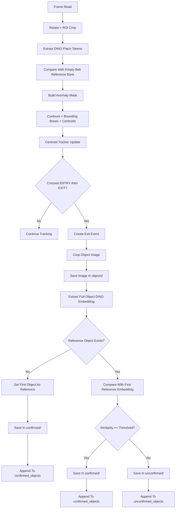

# Object Confirmation Flow Plan for `dinodiff-live-v2_edit.py`

## Goal

Keep the current DINO-based conveyor detection and line-cross counting flow, and add a new object save + confirmation stage:

1. When an object's center reaches/crosses the exit line, save its image in `objects/`.
2. The first exited object becomes the reference object and is saved in `confirmed/`.
3. Every next exited object is compared against that first confirmed object using DINO.
4. If it matches, save it in `confirmed/`.
5. If it does not match, save it in `unconfirmed/`.
6. Keep the needed metadata in `confirmed_objects` and `unconfirmed_objects` arrays.

## Current Code Flow

The current `dinodiff-live-v2_edit.py` already does this:

1. Load DINOv2 model.
2. Capture empty-belt reference frames.
3. Build DINO patch-token reference bank.
4. For each live frame:
   - crop conveyor ROI
   - extract DINO patch tokens
   - compare against empty-belt bank
   - create anomaly mask
   - find contours
   - compute centroids
   - track object centers with `CentroidTracker`
   - count when a tracked center crosses `ENTRY` and then `EXIT`

So the existing script is already good at:

- finding moving/anomalous objects on the belt
- tracking each object across frames
- deciding the count event when the tracked center crosses the exit line

What it does not store yet:

- object crop image at exit time
- object embedding for comparison
- confirmed/unconfirmed classification
- arrays with saved object metadata

## Main Change We Will Add

We will keep the current anomaly detection logic as-is and add a second stage after exit crossing:

1. Detect object as now.
2. Track object as now.
3. When the tracker reports that an object crossed the exit line:
   - capture that object's latest bounding box/crop
   - save the crop to `objects/`
   - build one DINO embedding for the crop
4. If this is the first exited object:
   - mark it as the baseline reference
   - save it to `confirmed/`
   - store it in `confirmed_objects`
5. If this is not the first exited object:
   - compare its DINO embedding with the first confirmed object's embedding
   - if similarity is above threshold: save to `confirmed/`
   - else: save to `unconfirmed/`
6. Store metadata in arrays for later use.

## Planned Folder Output

Three folders will be created at runtime:

- `objects/`
- `confirmed/`
- `unconfirmed/`

Each exited object will always be saved once in `objects/`, then also saved in either `confirmed/` or `unconfirmed/`.

Example naming:

```text
objects/object_0001_track_0003_frame_0152.jpg
confirmed/object_0001_track_0003_frame_0152.jpg
unconfirmed/object_0004_track_0011_frame_0338.jpg
```

## Planned In-Memory Data

We will add runtime state like this:

```python
reference_object = None
reference_embedding = None

all_exited_objects = []
confirmed_objects = []
unconfirmed_objects = []
```

Each array item should be a metadata dictionary like:

```python
{
    "object_index": 1,
    "track_id": 3,
    "frame_n": 152,
    "time_sec": 5.067,
    "bbox": (x1, y1, x2, y2),
    "object_path": "objects/object_0001_track_0003_frame_0152.jpg",
    "decision_path": "confirmed/object_0001_track_0003_frame_0152.jpg",
    "similarity": 1.0,
    "decision": "confirmed",
}
```

For the first object:

- `reference_object` points to its metadata
- `reference_embedding` stores its DINO embedding
- similarity can be recorded as `1.0`

## Why The Tracker Must Change

Right now the tracker stores only:

- centroid
- previous centroid
- crossed-entry flag
- counted flag

For the new feature, we also need the latest object shape information when the exit event happens:

- bounding box
- contour or mask
- object crop from the frame

So during implementation we should extend the detection/tracking handoff.

### Current handoff

```text
valid contour -> centroid only -> tracker
```

### Planned handoff

```text
valid contour -> detection record {centroid, bbox, contour, area} -> tracker
```

That lets us save the correct object crop at the exact exit event.

## Planned DINO Comparison Method

The script already uses DINO patch tokens for anomaly detection against the empty belt.

For object-to-object confirmation, we should use a separate full-object DINO embedding:

1. Crop object image from frame using its bounding box.
2. Optionally apply the object mask so belt background becomes black.
3. Resize/normalize the crop for DINO.
4. Run the DINO model to get one embedding vector for the object.
5. Compare embeddings with cosine similarity.

Comparison rule:

```text
similarity(reference_embedding, current_embedding) >= OBJECT_MATCH_THRESH
```

If true:

- object is `confirmed`

Else:

- object is `unconfirmed`

## Proposed Runtime Flow

### A. Startup

1. Load DINOv2.
2. Open video/live stream.
3. Capture empty-belt reference frames.
4. Build patch-token reference bank.
5. Create output folders:
   - `objects/`
   - `confirmed/`
   - `unconfirmed/`
6. Initialize:
   - tracker
   - count
   - `reference_object = None`
   - `reference_embedding = None`
   - arrays

### B. Per Frame Detection

1. Read frame.
2. Rotate frame if needed.
3. Crop ROI.
4. Extract DINO patch tokens.
5. Compare with empty-belt reference bank.
6. Build thresholded anomaly mask.
7. Clean mask with morphology.
8. Find contours.
9. For each valid contour:
   - compute centroid
   - compute bounding box
   - create detection record

### C. Tracking

1. Pass detection records into tracker.
2. Update tracked objects.
3. Check entry crossing.
4. Check exit crossing.
5. For every newly exited object, generate an `exit_event`.

### D. Exit Event Processing

For each `exit_event`:

1. Get that object's latest bbox/mask.
2. Crop object image from the current frame.
3. Save raw crop in `objects/`.
4. Extract DINO embedding for the crop.

Then branch:

#### Case 1: First exited object

1. Store crop and embedding as the reference object.
2. Save same crop in `confirmed/`.
3. Append metadata to:
   - `all_exited_objects`
   - `confirmed_objects`

#### Case 2: Later exited object

1. Compare its embedding with `reference_embedding`.
2. If similarity passes threshold:
   - save crop in `confirmed/`
   - append metadata to `all_exited_objects`
   - append metadata to `confirmed_objects`
3. Else:
   - save crop in `unconfirmed/`
   - append metadata to `all_exited_objects`
   - append metadata to `unconfirmed_objects`

### E. Reset Behavior

When the user presses `r`:

1. Rebuild empty-belt reference bank as the script already does.
2. Reset tracker and count.
3. Reset:
   - `reference_object`
   - `reference_embedding`
   - arrays
4. Keep saved image files on disk unless you later want a "clear folders" option.

## Planned Diagram



## Implementation Notes

### 1. New helper functions to add

- `ensure_output_dirs()`
- `extract_object_crop(frame, bbox, mask=None, padding=...)`
- `extract_object_embedding(crop_bgr)`
- `compare_object_embeddings(embedding_a, embedding_b)`
- `save_object_image(crop, folder, filename)`
- `handle_exit_event(...)`

### 2. Tracker updates to add

The tracker should keep per-object latest detection info:

- latest bbox
- latest contour area
- optional mask/crop reference
- saved/classified flag

This avoids saving the same track more than once.

### 3. Count logic update

Current code only returns `new_counts`.

Planned change:

- keep count behavior
- also return a list of object IDs that newly crossed the exit line

Example target:

```python
new_count_ids = tracker.check_line_crossings(...)
count += len(new_count_ids)
for oid in new_count_ids:
    handle_exit_event(...)
```

### 4. Matching threshold

We should add one config value for object comparison, for example:

```python
OBJECT_MATCH_THRESH = 0.80
```

This is only a starting point. Real samples may need tuning.

### 5. Crop style

Best practical plan:

- use bounding box from the latest contour
- add a small padding
- optionally black out background outside the object mask before DINO compare

This should give cleaner comparisons than comparing the full rectangle with belt background visible.

## Integration Points In The Existing File

The main code areas that will change later are:

1. Contour processing section
   - currently builds only `centroids`
   - will build full detection records

2. `CentroidTracker`
   - currently tracks only center/state flags
   - will store latest bbox/detection data too

3. Exit crossing section
   - currently only increments count
   - will also trigger save + DINO compare + classification

4. Reset section
   - currently resets reference bank, tracker, count
   - will also reset reference object memory and arrays

## Assumptions For Approval

This plan assumes:

1. The first object that exits is always accepted as the reference object.
2. Every next object is compared only against that first confirmed object, not against all confirmed objects.
3. Saved images remain on disk across resets; only in-memory arrays reset.
4. If two objects exit in the same frame, the lower track ID becomes the first reference object.
5. We keep the current entry/exit crossing logic and only add classification after the exit event.

## Summary

The safest implementation path is:

1. Keep the current DINO anomaly detection and counting flow unchanged.
2. Extend detections so each tracked object has bbox/crop information.
3. On exit crossing, save the object crop into `objects/`.
4. Use the first exited object as the DINO reference.
5. Classify later objects into `confirmed/` or `unconfirmed/`.
6. Store metadata in runtime arrays for later use.

This plan does not change code behavior yet. It is only the approved flow for the next implementation step.
